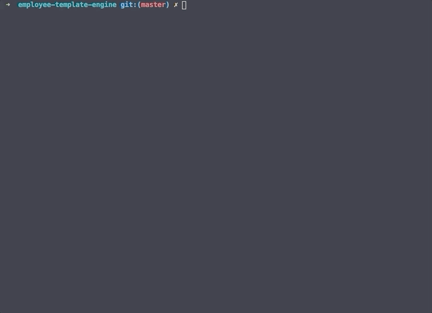
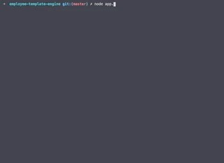
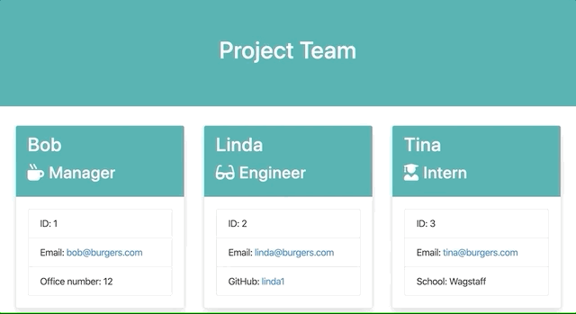

# Employee Template Engine

## Description

Creates a command line application that gathers user input and dynamically generates an HTML file using the collected data to show employee team members.

## GIFs illustrating functionality

The running and passing of all tests:

The start of the command line prompts:

The final command line prompts and creation of team html file after prompts are completed (new file appears on left side):

Opening the HTML file in VS Code:

Opening the HTML file in browser window:

## Link to GitHub repository:

https://github.com/bfeliz/employee-template-engine

## Author:

Brittany Fortner
